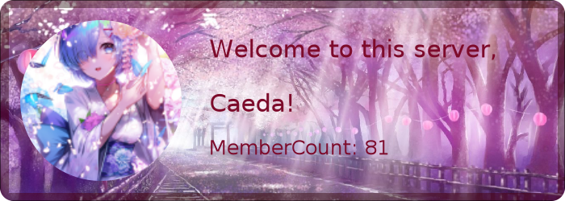
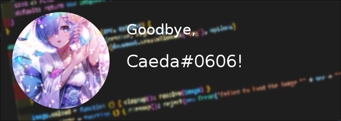

[](https://www.npmjs.com/package/@discord-card/greeting)
[](https://www.npmjs.com/package/@discord-card/greeting)
[](https://www.npmjs.com/package/@discord-card/greeting)
[](https://www.npmjs.com/package/@discord-card/greeting)

#  Discord Welcome Card
Simple Goodbye and welcome cards

## Examples
<details open> 
    <summary>  Welcome Card </summary>

```javascript
const Discord = require("discord.js");
const { welcomeImage } = require('discord-welcome-card');
const client = new Discord.Client();

client.on("message", async message => {
    if(message.author.bot) return
    //Generating the actual welcome Card
    const image = await welcomeImage(message.member);

    message.channel.send(new Discord.MessageAttachment(image, 'welcome.png'))
});

client.login('Your-Bot-Token');
```
    



</details>

<br />


<details> <summary> Goodbye Card </summary>

```javascript
const Discord = require("discord.js");
const { goodbyeImage } = require('discord-welcome-card');
const client = new Discord.Client();

client.on("message", async message => {
    if(message.author.bot) return
    //Generating the actual goodbye Card
    const image = await goodbyeImage(message.member, 'code');

    message.channel.send(new Discord.MessageAttachment(image, 'welcome.png'))
});

client.login('Your-Bot-Token');
```
    

    
</details>
<br />

<details><summary> Custom Card </summary>

```javascript
const Discord = require("discord.js");
const { drawCard } = require('discord-welcome-card');
const client = new Discord.Client();

client.on("message", async message => {
    if(message.author.bot) return
    //Generating the actual custom Card
    const image = await drawCard({
            blur: true,
            title: 'Title',
            theme: 'dark',
            text: 'Text',
            subtitle: 'Subtitle',
            rounded: true,
            border: true,
            avatar: message.member.user.avatarURL({ format: 'png' })
        })
    message.channel.send(new Discord.MessageAttachment(image, 'custom.png'))
});

client.login('Your-Bot-Token');
```
    


</details>
    
<br />

<details> <summary> Custom Card (custom Background) </summary>
folder strcuture:

folder
|-index.js
|-image.png

```javascript
const Discord = require("discord.js");
const { drawCard } = require('discord-welcome-card');
const client = new Discord.Client();

client.on("message", async message => {
    if(message.author.bot) return
    //Generating the actual custom Card
    const image = await drawCard({
            blur: true,
            title: 'Title',
            theme:  {
        image: "./image.png",
        color: new Gradient("linear", {
            color: "#4287f5",
            offset: 1
        }, {
            color: "#f5426f",
            offset: 0
        })
    },
            text: 'Text',
            subtitle: 'Subtitle',
            rounded: true,
            border: true,
            avatar: message.member.user.avatarURL({ format: 'png' })
        })
    message.channel.send(new Discord.MessageAttachment(image, 'custom.png'))
});

client.login('Your-Bot-Token');
```
    
</details>    

## Example projects
* [Miyuki](https://github.com/discord-card/Miyuki) (V13)

##  Changelog
| Version  | Content |
| ------------- | ------------- |
| 1.1.4 | new card backgrounds  |
| 1.1.5 | Added Auto Size  |
| 2.0.0 | Switched to typescript  |
| 2.0.1 | Added Custom Card Function  |
| 2.0.2 | Added more typings  |
| 2.1.0 | Added Custom Themes and Fonts  |
| 2.1.1 | Added Custom Functions to CanvasContext |
| 3.0.0 | Switched to `options-syntax` |
| 3.1.0 | Moved theme into options |
| 3.2.0 | Added `blur` |
| 3.3.0 | Added `round` |
| 3.3.1 | Renamed to `rounded` |
| 3.4.0 | Removed `hex-color-validation` |
| 3.5.0 | Added `gradient` |
| 3.5.1 | Fixxed broken Image |
| 3.6.0 | Removed `member` argument in `drawCard` |
| 3.7.0 | Removed `member` argument in `drawCard` |
| 3.7.1 | Fixxed options in `welcomeImage` Function |

