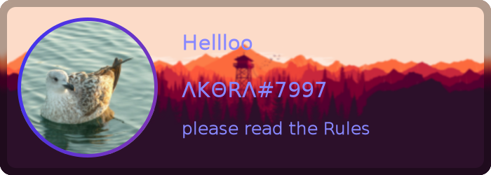
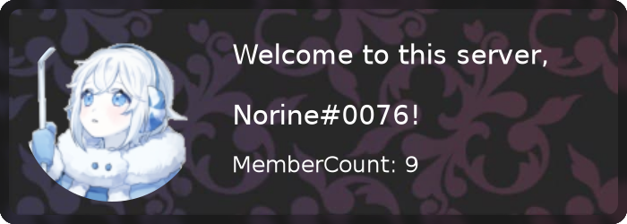
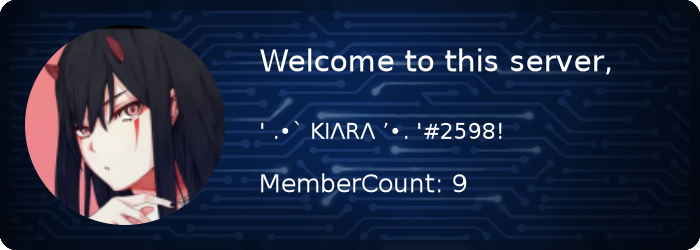
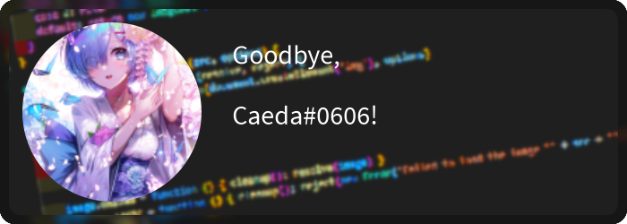

#  Discord Welcome Card
[](https://www.npmjs.com/package/discord-welcome-card)
[](https://www.npmjs.com/package/discord-welcome-card)
[](https://www.npmjs.com/package/discord-welcome-card)
[](https://www.npmjs.com/package/discord-welcome-card)

Simple easy-to-use Goodbye and welcome cards for your discord Bot. The version changelog could be found at [changelog.md](CHANGELOG.md). If you have any problems or questiosn considering this package, feel free to open a issue or join our [discord server](https://discord.gg/Emk2udJ).


## Features
* ⛩️ 3 default themes (circuit, code, dark)
* 🍭 gradient color support
* 🖼️ custom background support
*  📎 customizable cards (blur, rounded edges)
* 🗛 multiple font support
* 💿 rounded edges / border
* ⭕ avatar outline

(Note that all example codes below are for discord.js Version 13. Example usage code in Version 12, is provided in [another file](Usage.md))


## Card Options
```typescript
    theme?: "dark" | "circuit" | "code";    /** Select a theme with some default options */
    text?: {   /** Options for the text on the card */
        title?: string;      /** Text in the Top */
        text?: string; /**Text in the middle(big) */
        subtitle?: string; /** Text on the bottom */
        color?: `#${string}` | Gradient;      /** Font Color / Gradient */
        font?: string;  /** Custom Font */
    },
    avatar?: { /** Options for the avatar */
        image?: Canvas | Image | Buffer | string;   /** The Avatar Image, can be a URL/Canvas/Image or Buffer */
        outlineWidth?: number;  /** Width of the outline around the avatar in px */
        outlineColor?: `#${string}` | Gradient;   /** Color of the outline / Gradient */
    },
    background?: Canvas | Image | Buffer | string;  /** Override the Background, can be a URL/Canvas/Image or Buffer  */
    blur?: boolean | number;  /** If the background should be blurred (true -> 3) */
    border?: boolean;    /** When enabled a blurred border is drawn, enabled by default */
    rounded?: boolean; /** If enabled the edges will be rounded, enabled by default */
```

<details> 
    <summary> Full example </summary>
<b>If you want to use Gradients, you maybe need to import Gradient like this:</b>
<br /><br />

```javascript 
const { drawCard, Gradient } = require('discord-welcome-card')
```
    
```typescript
    theme: 'circuit',
    text: {
        title: 'Hellloo',
        text: user.tag,
        subtitle: 'please read the Rules',
        color: `#88f`
    },
    avatar: {
        image: user.displayAvatarURL({ format: 'png' }),
        outlineWidth: 5,
        outlineColor: new Gradient('linear',
            [0, '#33f'],
            [1, '#f33']
        )
    },
    background: 'https://i.imgur.com/ea9PB3H.png',
    blur: 1,
    border: true,
    rounded: true
```


</details>

<br/><br/><br/>


## Default themes & font colors


### Dark


### Circuit


### Code


<br/><br/><br/>


## Examples
(If you want to use Gradients, you maybe need to import Gradient like this: ```const { drawCard, Gradient } = require('discord-welcome-card')```)
<details open> 
    <summary>  Welcome Card (circuit) </summary>

```javascript
const { Client, Intents } = require("discord.js");
const { welcomeImage } = require('discord-welcome-card');
const client = new Client({
    intents: [Intents.FLAGS.GUILDS, Intents.FLAGS.GUILD_MESSAGES]
});

client.on("messageCreate", async message => {
    if(message.author.bot) return
    //Generating the actual welcome Card
    const image = await welcomeImage(message.member, { theme: 'circuit' });

    message.channel.send({ files: [ image ] })
});

client.login('Your-Bot-Token');
```
    


</details>

<br />


<details open> <summary> Goodbye Card </summary>

```javascript
const { Client, Intents } = require("discord.js");
const { goodbyeImage } = require('discord-welcome-card');
const client = new Client({
    intents: [Intents.FLAGS.GUILDS, Intents.FLAGS.GUILD_MESSAGES]
});

client.on("messageCreate", async message => {
    if(message.author.bot) return
    //Generating the actual goodbye Card
    const image = await goodbyeImage(message.member, { theme: 'code' });

    message.channel.send({ files: [ image ] });

client.login('Your-Bot-Token');
```
    

    
</details>
<br />

<details open><summary> Custom Card </summary>

```javascript
const { Client, Intents } = require("discord.js");
const { drawCard } = require('discord-welcome-card');
const client = new Client({
    intents: [Intents.FLAGS.GUILDS, Intents.FLAGS.GUILD_MESSAGES]
});

client.on("messageCreate", async message => {
    if(message.author.bot) return
    //Generating the actual custom Card
    const image = await drawCard({
        theme: "circuit",
        text: {
            title: 'Hellloo',
            text: message.author.tag,
            subtitle: 'please read the Rules',
            color: `#88f`
        },
        avatar: {
            image: message.author.displayAvatarURL({ format: 'png' }),
            outlineWidth: 5,
            outlineColor: new Gradient('linear',
                [0, '#33f'],
                [1, '#f33']
            ),
        },
        background: 'https://i.imgur.com/ea9PB3H.png',
        blur: 1,
        border: true,
        rounded: true
    });

    message.channel.send({ files: [ image ] })
});

client.login('Your-Bot-Token');
```
    


</details>  


## Example projects
Some projects written with this package
* [Miyuki](https://github.com/discord-card/Miyuki) (discord.js V13)

## Support Server
**[](https://discord.gg/EUbKBTwSmP)**
