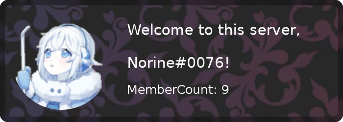
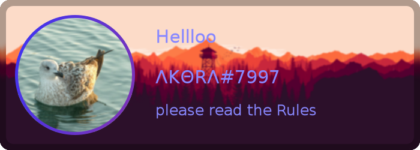

# Discord Welcome Card v12

## Examples

<details open> 
    <summary> Welcome Card (dark) </summary>

```javascript
const Discord = require('discord.js');
const { welcomeImage } = require('discord-welcome-card');
const client = new Discord.Client();

client.on('message', async (message) => {
  if (message.author.bot) return;
  //Generating the actual welcome Card
  const image = await welcomeImage(message.member, {
    theme: 'dark',
  });

  message.channel.send(new Discord.MessageAttachment(image, 'welcome.png'));
});

client.login('Your-Bot-Token');
```



</details>

<details> <summary> Goodbye Card (code) </summary>

```javascript
const Discord = require('discord.js');
const { goodbyeImage } = require('discord-welcome-card');
const client = new Discord.Client();

client.on('message', async (message) => {
  if (message.author.bot) return;
  //Generating the actual goodbye Card
  const image = await goodbyeImage(message.member, { theme: 'code' });

  message.channel.send(new Discord.MessageAttachment(image, 'goodbye.png'));
});

client.login('Your-Bot-Token');
```


</details>

<details><summary> Full Custom Card (Background from URL) </summary>

```javascript
const Discord = require('discord.js');
const { drawCard } = require('discord-welcome-card');
const client = new Discord.Client();

client.on('message', async (message) => {
  if (message.author.bot) return;
  //Generating the actual custom Card
  const image = await drawCard({
    theme: 'circuit',
    text: {
      title: 'Hellloo',
      text: message.author.tag,
      subtitle: 'please read the Rules',
      color: `#88f`,
    },
    avatar: {
      image: message.author.displayAvatarURL({ extension: 'png' }),
      outlineWidth: 5,
      outlineColor: new Gradient('linear', [0, '#33f'], [1, '#f33']),
    },
    background: 'https://i.imgur.com/ea9PB3H.png',
    blur: 1,
    border: true,
    rounded: true,
  });
  message.channel.send(new Discord.MessageAttachment(image, 'custom.png'));
});

client.login('Your-Bot-Token');
```



</details>

<details> <summary> Custom Card (custom Background from file) </summary>
folder strcuture:

```
folder
|-index.js
|-image.png
```

```javascript
const Discord = require('discord.js');
const { drawCard } = require('discord-welcome-card');
const client = new Discord.Client();

client.on('message', async (message) => {
  if (message.author.bot) return;
  //Generating the actual custom Card
  const image = await drawCard({
    text: {
      title: 'Title',
      text: 'Text',
      subtitle: 'Subtitle',
      color: new Gradient(
        'linear',
        {
          color: '#4287f5',
          offset: 1,
        },
        {
          color: '#f5426f',
          offset: 0,
        }
      ),
    },
    avatar: {
      image: message.member.user.avatarURL({ extension: 'png' }),
    },
    background: './image.png',
    blur: true,
    border: true,
    rounded: true,
  });
  message.channel.send(new Discord.MessageAttachment(image, 'custom.png'));
});

client.login('Your-Bot-Token');
```

</details>

## Support Server

**[](https://discord.gg/Emk2udJ)**
