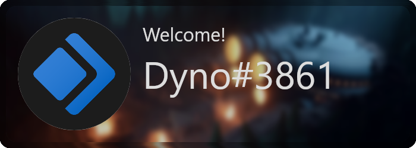

# minimal
  This card was designed and developed by @AmitKumarHQ
  
  

  ```js
  const image = await drawCard({
    theme: 'dark',
    blur: false,
    rounded: true,
    text: {
      title: new Text('Welcome!', 240, 70).setFontSize(32),
      text: new Text(member.user.tag, 240, 150).setFontSize(64),
      color: `#DDDDDD`,
      font: 'Panton Black Caps',
    },
    avatar: {
      image: avatar,
      outlineWidth: 5,
      outlineColor: `#DDDDDD`,
    },
    background: join(__dirname, './background.png'),
  });
  ```
  